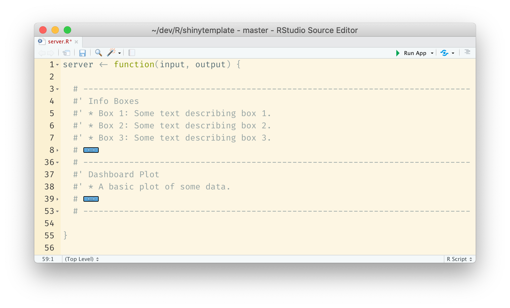

<!-- README.md is generated from README.Rmd. Please edit that file -->

# shinytemplate

<!-- badges: start -->

<!-- badges: end -->

<!-- -->

An opinionated template for shiny dashboards (work in progress). The
goal is to collect a bunch of things I commonly use when creating a
dashboard (CSS, file structure, style, etc.), so I can skip all of this
when a new project comes along.

## Structure

I use `ui.R`, `server.R`, and `global.R` instead of a single `app.R`
file to split the application into smaller pieces. All ui elements are
prefixed with `ui_`, utility functions are stored in `utils.R`, all R
code (excluding ui, server, and global) are stored in the R directory.
The inst/extdata directory is just a habit I picked up from R packages,
I store images and other external data here.

    #> .
    #> ├── R
    #> │   ├── ui_dashboard_body.R
    #> │   ├── ui_dashboard_header.R
    #> │   ├── ui_dashboard_sidebar.R
    #> │   ├── ui_tabs.R
    #> │   └── utils.R
    #> ├── README.Rmd
    #> ├── README.md
    #> ├── global.R
    #> ├── inst
    #> │   └── extdata
    #> │       ├── example-app.png
    #> │       └── server-comments.png
    #> ├── server.R
    #> ├── shinytemplate.Rproj
    #> ├── ui.R
    #> └── www
    #>     └── custom.css

## Comments

Server code is commented like
    so:

    # ----------------------------------------------------------------------------
    #' Info Boxes
    #' * Box 1: Some text describing box 1.
    #' * Box 2: Some text describing box 2.
    #' * Box 3: Some text describing box 3.
    # ----------------------------------------------------------------------------

Where a specific component is labeled and individual pieces are
described. This can make large server files a bit more manageable if you
use code folding:

<!-- -->
